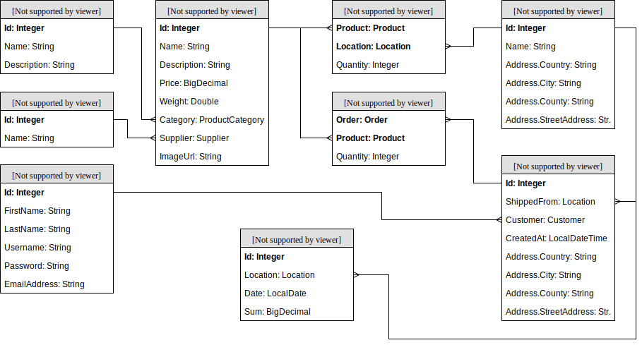

# Node.js Training: Resources

## Contents

 - [Working Mode](#working-mode)
 - [Online Shop](#online-shop)
 - [0. JavaScript, Git, NPM](#0-javascript-git-npm)
 - [1. Node.js](#1-nodejs)
 - [2. NestJS](#2-nestjs)
 - [3. REST APIs](#3-rest-api)
 - [4. Database](#4-database)
 - [5. Security](#5-security)
 - [6. The `fs` module](#6-the-fs-module)
 - [7. Axios](#7-axios)

## Working Mode

The road-map consists of several steps. In each step, a set of theoretical concepts are explored, supported by reference documentation, book chapters, tutorials and videos. In parallel, a simple application will be built with the learned concepts: the *Online Shop* application.

After the learning material for a given step was sufficiently explored, either some new functionality will be added to this application or old functionality will be refactored.

The application will have little-to-no user interface. Developers are expected to perform developer tests with Postman once the REST APIs are implemented.

All the code written must be published on GitHub. Access the [this link](https://classroom.github.com/a/d3mb3yKU) to create your own repository. Commits must be pushed when each individual chapter is finished. In order to request a code review from the trainers, you must [open a pull request](https://help.github.com/en/articles/creating-a-pull-request) from the `develop` to the `master` branch.

You can work using your local environment. You need to install:
 - [NodeJS 12](https://nodejs.org/en/) 
 - [VSCode](https://code.visualstudio.com/download), with the [ESLint plugin](https://marketplace.visualstudio.com/items?itemName=dbaeumer.vscode-eslint) or [Webstorm](https://www.jetbrains.com/webstorm/) (if you have the license) where you can download ESLint via plugins.
 - [Postman](https://www.postman.com/)
 - [PostgreSQL](https://www.postgresql.org/download/)
 
 For doing static code quality checks, two separate mechanisms will be used:
 - The plugin for ESlint code analysis must be used to identify code issues.
 - [Prettier](https://prettier.io) will be enabled and developers should run it in order to make their code comply with basics of good format.
 
 ## Online Shop
The application will deal with the management and daily functioning of a small online shop. Business processes:
 - **Order creation**: an end customer places an order to buy several products (based on the availability of the products in the stock).
 - **Stock management**: the existing product stocks are updated automatically based on the orders placed by customers.
 - **Shop analytics**: the management must be able to view the evolution of the daily revenue for each individual location of the shop.

Throughout the application, we assume that prices are always in EUR and weights are always in KG. 

### 0. JavaScript, Git, NPM

Goal: Getting familiar with the ecosystem around NodeJS. You can skip this and the next chapter if you have already worked with JavaScript, Git and npm before.

Required Reading:

 - [Git Basics](https://git-scm.com/book/en/v1/Getting-Started-Git-Basics)
 - [NPM Intro](https://nodesource.com/blog/an-absolute-beginners-guide-to-using-npm/)
 - [JavaScript](https://htmldog.com/guides/javascript/beginner/)
 - [ESLint](https://eslint.org/docs/user-guide/getting-started)

Online Shop: 

 > Clone your repository. Initialize your node project using npm init.
 >
 > Create a `index.js` file which prints a `hello world` message to the console. Mark this file as the main file in your `package.json` and create a `start` script which runs `node index.js`. Check that your message is printed by running `npm start` in the terminal.
 
Further Resources:

 - [GitHub - Hello World](https://guides.github.com/activities/hello-world/)
 - [Git - CLI Fundamentals](https://www.youtube.com/watch?v=HVsySz-h9r4)
 
 ### 1. Node.js

Goal: Learn how to run a simple Node.js program and debug it.

Required Reading:

 - [Node.js: Getting started](https://nodejs.dev/run-nodejs-scripts-from-the-command-line)

Online Shop: 

 > Create a `index.js` file which prints a `hello world` message to the console. Mark this file as the main file in your `package.json` and create a `start` script which runs `node index.js`. Check that your message is printed by running `npm start` in the terminal.
 >
 > Debug your code:
 > - Add a new `start:debug` npm script to your package.json. This script should execute `node index.js --inspect-brk`. The `inspect-brk` switch instructs Node.js to listen on a debugging port for the debugger and to not start code execution before the debugger attaches.
 > - Start this new script in a terminal.
 > - Place a breakpoint in your code.
 > - Create a new VSCode debugging configuration (with the default `Node.js: Attach` settings) and start it.
 > - Start the debugger.
 
Further Resources:

 - [Asynchronous programming in Node.js](https://codeforgeek.com/asynchronous-programming-in-node-js/)
 - [Debugging in VSCode](https://code.visualstudio.com/docs/editor/debugging)
 
 
### 2. NestJS

Goal: Setting up your NestJS server.

Required Reading:

- [What is NestJS?](https://enlear.academy/why-you-should-use-nestjs-as-your-backend-framework-bd1ff1acce5d)
- [NestJS first steps](https://docs.nestjs.com/first-steps)
 
Online Shop:
> Forget about the project you created before this. You will be now using a framework to help organize things.
> Install nest CLI via 'npm i -g @nestjs/cli' then initiate your project with 'nest new project-name'.
> Create a test endpoint within the app controller (for example GET - that returns 'Hello World').
> Test your endpoint via Postman.
> You may use this chapter to further familiarize yourself with concepts such as: Modules, Controllers, Providers, Pipes.

 
### 3. REST API
 
Goal: Build RESTful APIs.
 
Required Reading:

- [Getting started with NestJS](https://www.digitalocean.com/community/tutorials/getting-started-with-nestjs)

Online Shop: 

> Create a module for the entities you will use (categories and products). You will design them using the MVC pattern, thus each module will have:
 > - models
 > - DTOs
 > - repository (for now store the data within an array of objects, later chapters will improve on this)
 > - service
 > - controller
 
> Create a simple API for exposing the products and product categories, supporting the following operations:
 > - Reading all categories,
 > - Reading all products in a given category (by id),
 > - Reading a given product by id,
 > - Creating a new product in a given category (by id),
 > - Updating a product by id
 > - Deleting a product by id
 >
 > Test these APIs using Postman.
 

### 4. Database 

Goal: Using TypeORM & PostgreSQL to persist the application data instead of the in-memory repositories.

Required Reading:

 - [TypeORM Documentation](https://typeorm.io)
 - [Integrating TypeORM with NestJS](https://docs.nestjs.com/techniques/database)
 - [Using PG with TypeORM](https://www.thisdot.co/blog/connecting-to-postgresql-using-typeorm)

Online Shop: 

 > Integrate TypeORM with PostgreSQL, in your NestJS application. You will essentially now be store your data within the database.
 > 
 > You can remove the old in-memory repository implementations.
 

### 5. Security

Goal: Add user authentication and authorization to your backend.

Required Reading:
- [Security](https://docs.nestjs.com/openapi/security)
- [Authentication](https://docs.nestjs.com/security/authentication)

Online Shop:

> Add authentication based on JWT tokens, accessible only for registered users. You will create an admin role and a customer role, which will determine their permissions within the api.
> 
> Secure all your routes in such way that only admins can create, update and delete products, and only admin and customers can access the rest of the endpoints.

Further Resources:
- [Helmet](https://docs.nestjs.com/security/helmet)
- [Developing a Secure API with NestJS: Getting Started](https://auth0.com/blog/developing-a-secure-api-with-nestjs-getting-started/)

### 6. The `fs` module

Goal: Know how to use the most common file system operations in Node.js.

Required Reading:

 - [Node.js: File System APIs](https://nodejs.org/api/fs.html#fs_file_system)
 - [File Uploading](https://docs.nestjs.com/techniques/file-upload)
 - [File Streaming](https://docs.nestjs.com/techniques/streaming-files)

Online Shop: 

 > Use the file system to store and then serve images for the products. These images should be stored in a git-ignored `tmp` folder inside your project. Create dedicated APIs for:
 > - Uploading a new image for a product (by id),
 > - Remove the image of a product,
 > - Retrieve the image of a product (by id) - here you should use Streams,
 > - List all images.
 >
 > Of course, when a product is deleted, it's corresponding image should also be deleted if it exists.
 
Further Resources:

 - [Node.js file system intro](https://www.tutorialsteacher.com/nodejs/nodejs-file-system)
 - [Mastering the Node.js core modules](https://blog.risingstack.com/mastering-the-nodejs-core-modules-file-system-fs-module/)
 
 ### 7. Axios
 
 Goal: Integrate a third party API using axios.
 
 Required Reading:
 
  - [Axios Tutorial](https://medium.com/@amchris98/axios-tutorial-7e1fe28b8b05)
  - [HTTP Module in NestJS](https://docs.nestjs.com/techniques/http-module)
  
Online Shop: 

 > Create a new REST API that handles the creation of orders. The following constraints apply:
 >
 > - You get a single JSON object as input. This object will contain the order timestamp, the delivery address and a list of products (product ID and quantity) contained in the order.
 > - You return an Order entity if the operation was successful. If not, you return an exception response.
 > - The app has to select a strategy for finding from which locations should the products be taken. The strategy should be selected based on an environment variable. The following strategies should be created: 
 >   - **Most abundant** - take each product from the location which has the largest stock for that particular product.
 >   - **Closest location** -  find the location which is the closest to the order's delivery address, take all the available needed products from that location. Until we have all the products we need, repeat the before steps (by going to the second closest location, then to the third and so on). 
 > - The app then runs the strategy, obtaining a list of objects with the following structure: location, product, quantity (= how many items of the given product are taken from the given location). If the strategy is unable to find a suitable set of locations, it should throw an exception.
 > - The stocks are be updated by subtracting the shipped goods. 
 > - Afterwards the order is persisted in the database and returned.
 > 
 > You will need to also create the underlying mongoose models and corresponding repository objects for the stocks, locations, orders, etc.
 >
 > To compute the distances for the *closest location* strategy, use axios to call the [MapQuest route matrix API](https://developer.mapquest.com/documentation/directions-api/route-matrix/post/). You will first need to [register on the MapQuest site](https://developer.mapquest.com/plan_purchase/steps/business_edition/business_edition_free/register) and obtain an API Key.
 
 Further Resources:
 
  - [Axios documentation](https://github.com/axios/axios)
